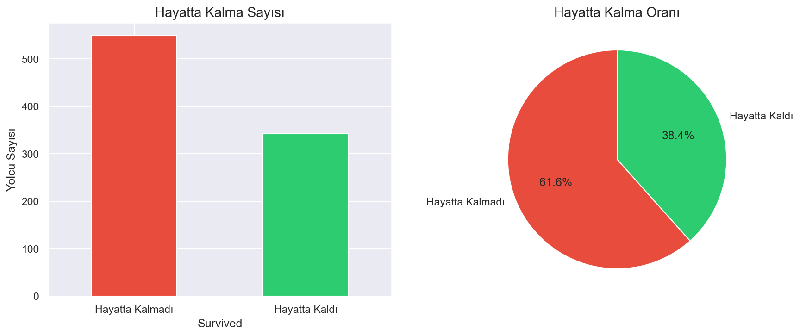
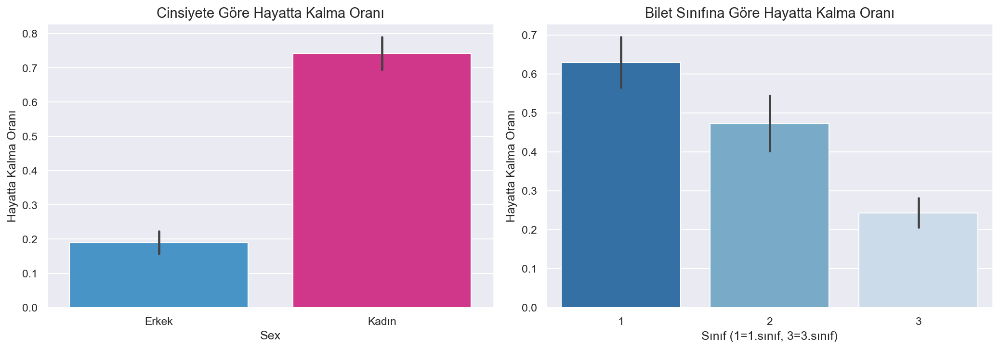
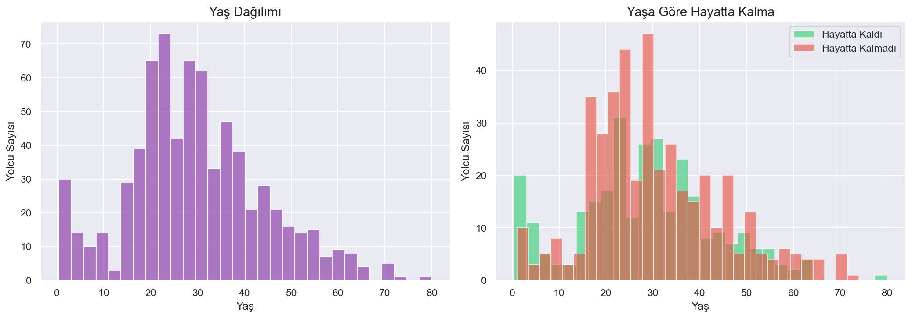
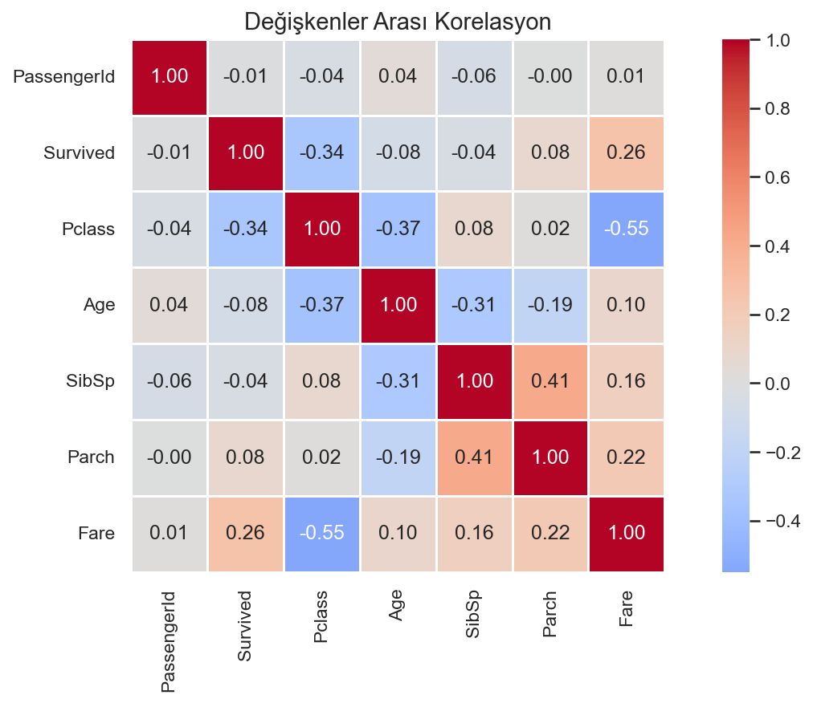
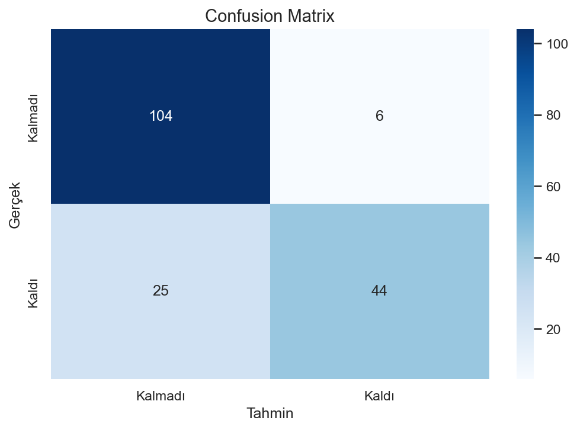
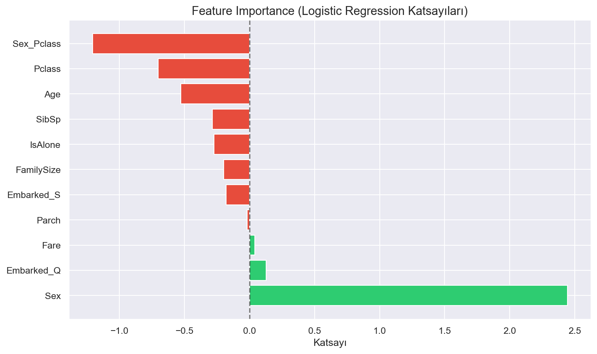

# titanic-survival-analysis
# 🚢 Titanic Survival Analysis

**[TR]** Titanic yolcu verisi üzerinde keşifsel veri analizi (EDA) ve makine öğrenimi ile hayatta kalma tahmini.

**[EN]** Exploratory data analysis (EDA) and survival prediction using machine learning on the Titanic passenger dataset.

---

## 📊 Proje Özeti / Project Summary

| Metrik / Metric | Değer / Value |
|----------------|---------------|
| Model | Logistic Regression |
| Test Accuracy | %82.7 |
| Test F1-Score (weighted) | 0.82 |
| Veri Seti / Dataset | 891 yolcu / passengers, 12 özellik / features |

---

## 🔍 Temel Bulgular / Key Findings

**[TR]**
- Cinsiyet en güçlü hayatta kalma göstergesidir: kadınların %74'ü, erkeklerin yalnızca %19'u hayatta kaldı
- 3\. sınıf kadın yolcular (%50), 1\. sınıf erkek yolculardan (%37) daha yüksek hayatta kalma oranına sahip — cinsiyet, sınıftan daha belirleyici
- 10 yaş altı çocuklarda hayatta kalma oranı %61 — genel ortalamanın (%38) çok üzerinde
- Pclass ve Fare değişkenleri arasında -0.55 korelasyon mevcut; aynı bilgiyi farklı ölçekte temsil ediyorlar

**[EN]**
- Gender is the strongest survival predictor: 74% of women survived vs. only 19% of men
- 3rd class women (50%) outsurvived 1st class men (37%) — gender dominates over ticket class
- Children under 10 had a 61% survival rate — well above the overall average of 38%
- Pclass and Fare show -0.55 correlation; they represent similar information at different scales

---

## 📈 Görseller / Visualizations

### Hayatta Kalma Dağılımı / Survival Distribution


### Cinsiyet & Sınıf Etkisi / Gender & Class Effect


### Yaş Dağılımı / Age Distribution


### Korelasyon Haritası / Correlation Heatmap


### Confusion Matrix


### Feature Importance


---

## 🛠️ Kullanılan Teknolojiler / Tech Stack


---

## 🚀 Çalıştırmak İçin / How to Run
```bash
git clone https://github.com/Tuna9826/titanic-survival-analysis
cd titanic-survival-analysis
pip install -r requirements.txt
jupyter notebook hafta1proje.ipynb
```

---

## 👤 İletişim / Contact

**GitHub:** [Tuna9826](https://github.com/Tuna9826)
